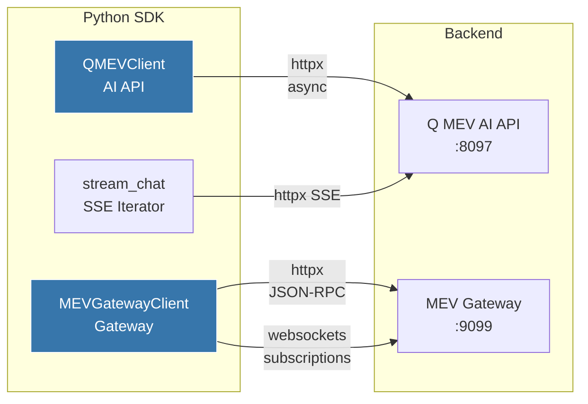

# yoorquezt-sdk-mev

> Python SDK for YoorQuezt MEV Infrastructure

[](https://www.python.org/)
[](https://pypi.org/project/yoorquezt-sdk-mev/)
[](LICENSE)

## Overview

Fully async Python client for the Q MEV AI API and MEV Gateway. Built on `httpx` for HTTP, `websockets` for real-time subscriptions, and `pydantic` for type-safe response models. Supports chat interactions, SSE streaming, bundle operations, and live MEV event subscriptions.



## Installation

```bash
pip install yoorquezt-sdk-mev
```

## Quick Start

### Chat with Q

```python
from yoorquezt_mev import QMEVClient, MEVRole

async with QMEVClient(
    api_url="http://localhost:8097",
    api_key="yqz_mev_...",
    role=MEVRole.SEARCHER,
) as client:
    # Simple query
    response = await client.chat("Find arb opportunities for WETH/USDC")
    print(response.content)
    print(f"Tools called: {[t.tool_name for t in response.tool_calls]}")

    # Multi-turn conversation
    follow_up = await client.chat(
        "Simulate the top opportunity",
        conversation_id=response.id,
    )
```

### Stream Responses

```python
# Async iterator
async for token in client.chat_stream_iter("Analyze the current mempool"):
    print(token, end="", flush=True)

# Callback style
response = await client.chat_stream(
    "Show relay performance",
    on_token=lambda t: print(t, end=""),
)
```

### MEV Gateway Operations

```python
from yoorquezt_mev import MEVGatewayClient, Bundle

async with MEVGatewayClient(
    url="http://localhost:9099",
    api_key="yqz_gw_...",
) as gw:
    # Submit a bundle
    bundle = Bundle(
        transactions=["0xsigned_tx_1...", "0xsigned_tx_2..."],
        block_number=19500000,
    )
    bundle_id = await gw.submit_bundle(bundle)

    # Check status
    status = await gw.get_bundle_status(bundle_id)
    print(f"Status: {status.status}, Profit: {status.profit}")

    # Simulate before submitting
    sim = await gw.simulate_bundle(bundle)
    print(f"Gas: {sim.gas_used}, Profit: {sim.profit}")

    # Auction state
    auction = await gw.get_auction()

    # Relay stats
    relays = await gw.get_relay_stats()

    # OFA stats
    ofa = await gw.get_ofa_stats("24h")

    # Profit history
    profits = await gw.get_profit_history("7d", strategy="arbitrage")
```

### Real-Time Subscriptions

```python
async def handle_event(event):
    print(f"[{event.severity}] {event.type}: {event.data}")

sub_id = await gw.subscribe(
    topics=["bundle_landed", "sandwich_blocked", "arb_found"],
    on_event=handle_event,
)

# Later: unsubscribe
await gw.unsubscribe(sub_id)
```

## API Reference

### QMEVClient

| Method | Signature | Description |
|--------|-----------|-------------|
| `chat` | `async chat(message, conversation_id?, context?) -> ChatResponse` | Send a chat message |
| `chat_stream` | `async chat_stream(message, on_token?, conversation_id?) -> ChatResponse` | Stream with callback |
| `chat_stream_iter` | `chat_stream_iter(message, conversation_id?) -> AsyncIterator[str]` | Stream as async iterator |
| `list_tools` | `async list_tools() -> list[QMEVTool]` | List available tools |
| `health` | `async health() -> EngineHealth` | Get engine health |
| `close` | `async close()` | Close HTTP client |

### MEVGatewayClient

| Method | Signature | Description |
|--------|-----------|-------------|
| `submit_bundle` | `async submit_bundle(bundle) -> str` | Submit bundle, returns ID |
| `get_bundle_status` | `async get_bundle_status(bundle_id) -> BundleStatus` | Get bundle status |
| `simulate_bundle` | `async simulate_bundle(bundle) -> SimulationResult` | Simulate bundle |
| `get_auction` | `async get_auction(block_number?) -> Auction` | Get auction state |
| `get_mempool_snapshot` | `async get_mempool_snapshot() -> MempoolSnapshot` | Get mempool state |
| `get_relay_stats` | `async get_relay_stats(relay_id?) -> list[RelayStats]` | Get relay stats |
| `get_ofa_stats` | `async get_ofa_stats(time_range?) -> OFAStats` | Get OFA stats |
| `get_profit_history` | `async get_profit_history(time_range?, strategy?) -> ProfitHistory` | Get profit history |
| `subscribe` | `async subscribe(topics, on_event) -> str` | Subscribe to events |
| `unsubscribe` | `async unsubscribe(subscription_id)` | Unsubscribe |
| `call` | `async call(method, params?) -> Any` | Raw JSON-RPC call |
| `close` | `async close()` | Close all connections |

## Key Types (Pydantic Models)

```python
class MEVRole(str, Enum):
    SEARCHER = "searcher"
    BUILDER = "builder"
    VALIDATOR = "validator"
    OPERATOR = "operator"
    ANALYST = "analyst"

class BundleStatus(BaseModel):
    bundle_id: str
    status: Literal["pending", "included", "failed", "expired"]
    block_number: int | None
    tx_hash: str | None
    profit: str | None

class SimulationResult(BaseModel):
    success: bool
    gas_used: int
    profit: str
    revert_reason: str | None

class MEVEvent(BaseModel):
    type: str
    severity: Literal["info", "warning", "critical"]
    data: dict[str, Any]
    timestamp: float

class EngineHealth(BaseModel):
    status: Literal["healthy", "degraded", "unhealthy"]
    uptime: int
    peer_count: int
    last_block: int
    relays_connected: int
    memory_mb: float
    goroutines: int
```

## Error Handling

```python
from yoorquezt_mev import QMEVError

try:
    await gw.submit_bundle(bundle)
except QMEVError as e:
    match e.code:
        case "AUTH_ERROR":      ...  # Invalid API key
        case "NETWORK_ERROR":   ...  # Connection failed
        case "HTTP_ERROR":      ...  # Non-200 response
        case "RPC_ERROR":       ...  # JSON-RPC error
```

## Development

```bash
pip install -e ".[dev]"
pytest                    # Run all tests
pytest -x --asyncio-mode=auto   # With async support
```

## Requirements

- Python >= 3.10
- `httpx` >= 0.27
- `websockets` >= 13.0
- `pydantic` >= 2.0
